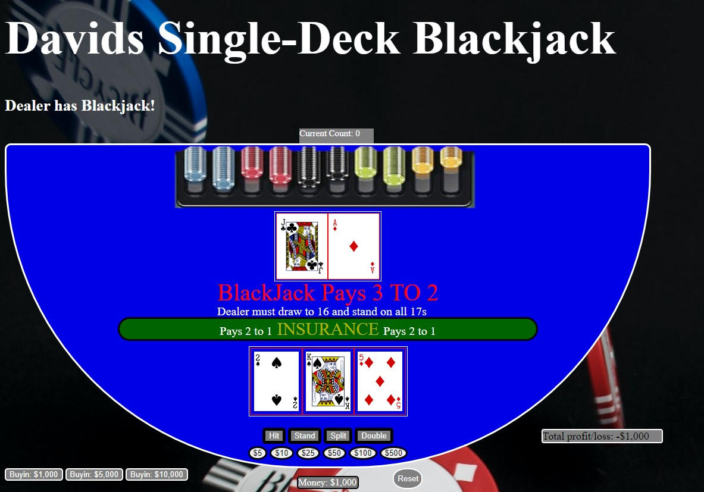

# BlackJack-Project
# H1 **Davids Single-Deck Blackjack!**

Blackjack is one of the classic card games! Its a must know for anyone wanting to visit Las Vegas! The concept of the game is very simple. You are playing 1 on 1 against the dealer. Whoever gets closest to 21 wins! Of course it gets a bit more complicated than that, but thats the general gist of the game! Any numbered playing cards, count as those values.(For example, a 2 of spades, would be worth 2 points). The Face cards(Jack, King, Queen, Ace) however, work a bit differently. Jack,King, and Queen are all worth 10 points. Ace is the real trickster. The Ace card will automatically be counted as 11 points, UNLESS you draw too many cards and go over 21, In that case the Ace will count as 1 point. And of course the name of the game itself, BLACKJACK! A Blackjack can only occur on the first 2 cards the player or the dealer are dealt. If they add up to 21, Then youve got a Blackjack! This is the best possible scenario, because not only does it almost guarantee that you win, But it also pays you more money for getting it! Only way to "lose" if you have a blackjack, is if the dealer also has a blackjack, in which case its a push, and nobody wins/loses that round.

Heres a quick Preview of my Blackjack Game!

## H2 Technologies Used: 

Javascript, HTML, CSS

## H2 Getting Started: 

Once youre ready, Load up the game by clicking on the link below and do your best to take down the house!
[Blackjack!](https://sheedkik.github.io/BlackJack-Project/)

### H3 Next steps:

 I have a lot of plans for this game in the future. Blackjack is by far my favorite card game, so I want to make it as great as it can be. 

 - The next things to be added to the game with be adding in a 2nd deck, to be able to play Double-Deck blackjack. 
 - From there, I'll be adding in login to allow more of a realistic gameplay. That would include allow for splitting and doubling your bets. 
 - My ultimate goal is to make this something people can actually use to improve and learn. So I will also be adding a feature for it to teach you to play "by the book". It will know the correct play for you to make in the situation, and will let you know if you statistically made the correct play or not. 
 - I will also be adding a feature for the game to keep a running "count" of the decks as the game is being played, and periodically it will test you on what the current count is. This is to help people who want to learn how to count cards while playing blackjack.